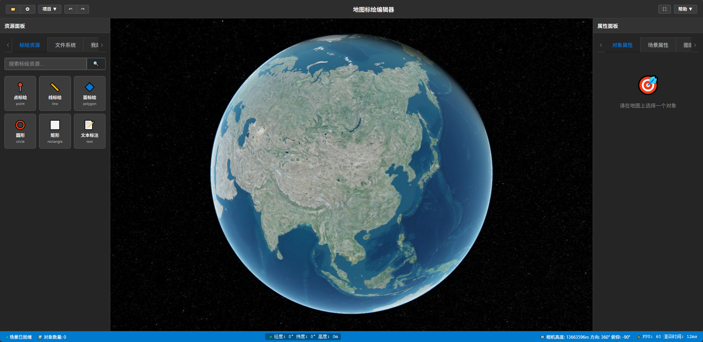

# 地图标绘编辑器 (Map Plotting Editor by AI)

一个基于 Vue 3 + Cesium 的地图标绘编辑器，支持各种标绘资源拖放、绘制、属性编辑。
本工程完全使用AI自行编写代码。

## 🎨 截图


## ✅ 主要功能

待完善

## 🚀 技术栈

- **前端框架**: Vue 3 + Vite
- **3D引擎**: Cesium
- **构建工具**: Vite
- **样式**: Sass
- **网络请求**: Fetch API
- **工具库**: 
  - Element Plus - 主流UI组件库
  - Lodash - 实用工具函数库
  - Day.js - 轻量级日期时间库
  - Cesium - Cesium三维地图引擎

## 📁 项目结构

```
plotting-editor-by-ai/
├── src/
│   ├── components/                           # Vue 组件
│   │   ├── editor/                           # 编辑器 UI 组件
│   │   │   ├── PropertyPanel.vue             # 属性面板
│   │   │   ├── Toolbar.vue                   # 工具栏
│   │   │   ├── EditorFooter.vue              # 编辑器底部状态栏
│   │   │   ├── ResourcePanel.vue             # 资源面板
│   │   │   ├── VfsFilePanel.vue              # 虚拟文件系统面板
│   │   │   ├── Inspector.vue                 # 对象检查器
│   │   ├── property/                         # 各种属性编辑组件
│   │   │   ├── ScenePropertyPane.vue         # 场景属性编辑面板
│   │   │   ├── BasePropertyPane.vue          # 对象基础属性编辑面板
│   │   ├── dialog/                           # 各类对话框组件
│   │   ├── scene/                            # 3D 场景组件
│   │   │   ├── SceneViewer.vue               # 主场景视图（基于 Cesium）
│   ├── composables/                          # Vue Composition API 可组合函数
│   │   ├── useScene.js                       # 场景管理（Cesium 1.132.0）
│   │   ├── useObjectSelection.js             # 对象选择功能
│   │   ├── useAssets.js                      # 资源管理
│   │   ├── useEditorConfig.js                # 编辑器配置响应式状态与操作方法
│   │   ├── static-drive-api.js               # 静态文件系统封装
│   │   ├── vfs-service.js                    # 虚拟文件系统服务
│   ├── core/                                 # 核心 Cesium 逻辑
│   │   ├── SceneManager.js                   # 场景管理器
│   │   ├── ObjectManager.js                  # 对象管理器
│   ├── utils/                                # 工具函数
│   │   ├── mathUtils.js                      # 数学工具
│   │   ├── geometryUtils.js                  # 几何工具
│   │   ├── fileUtils.js                      # 文件处理工具
│   ├── constants/                            # 常量定义
│   │   ├── DEFAULT_VIEWER_OPTIONS.js         # 默认Viewer配置
│   │   ├── DEFAULT_CENTER.js                 # 默认中心点配置（北京坐标）
│   │   ├── DEFAULT_CAMERA.js                 # 默认相机配置（引用DEFAULT_CENTER）
│   ├── App.vue                               # 根组件（仅负责引入Editor.vue）
│   ├── Editor.vue                            # 主编辑器组件（包含全部业务与UI）
│   ├── main.js                               # 应用入口
│   ├── main-func.js                          # 应用入口文件相关的功能函数
│   ├── style.scss                            # 全局样式
├── public/                                   # 存放无需构建的静态资源
│   ├── images/                               # 图片资源目录
│   ├── vfs/                                  # 静态资源目录（虚拟文件系统）
├── script/                                   # 脚本
│   ├── package.json                          # 脚本子项目配置
│   ├── generate-vfs.js                       # 脚本：生成虚拟文件系统的元数据
│   ├── vfs-server.js                         # 脚本：虚拟文件系统后端服务
├── index.html                                # HTML 模板
├── package.json                              # 项目配置
├── vite.config.js                            # Vite 配置
├── README.md                                 # 项目说明
├── CESIUM_CHANGELOG.md                       # Cesium 版本更新日志

```

## 🏗️ 架构设计

### 组件层次

1. **主编辑器组件** (`Editor.vue`): 负责所有业务逻辑和UI的集成
2. **UI 层** (`components/editor/`, `components/dialog/`): 负责用户界面和交互
3. **地图渲染层** (`components/scene/`): 处理 Cesium 地图场景渲染和显示
4. **逻辑层** (`composables/`, `core/`): 业务逻辑和状态管理
5. **服务层** (`services/`): 数据请求和外部接口
6. **工具层** (`utils/`): 通用工具函数

### 技术特点

- **响应式状态**: 使用 Vue 3 Composition API 管理应用状态
- **模块化设计**: 清晰的代码组织和职责分离
- **Cesium 集成**: 基于 Cesium 1.132.0，使用最新 API（移除 ready/readyPromise，使用 baseLayer 等）
- **类型安全**: 良好的代码结构支持 TypeScript 迁移
- **性能优化**: 合理的组件懒加载和渲染优化

### Cesium 新版特性应用

- 使用 `baseLayer` 替代 `imageryProvider`
- 移除对 `ready` 和 `readyPromise` 的依赖
- 使用 `Scene.verticalExaggeration` 替代 `Globe.terrainExaggeration`
- 采用 ESM 模块化，不依赖内置 RequireJS

## 📋 开发规范

- 遵循 Vue 3 组合式 API 最佳实践
- 使用 ES6+ 语法特性
- 组件命名采用 PascalCase
- 文件和目录命名采用 camelCase
- Git 提交信息格式: `feat: 功能描述`

## 重要逻辑

### 数据结构
- 使用GeoJSON作为标绘信息的数据结构
- 在GeoJSON数据结构的基础上增加一些该编辑器专用的附加信息
标绘信息数据结构如下：
```js
{
    "type": "FeatureCollection",
    "features": [
        {
            "type": "Feature",
            "geometry": { // 遵循GeoJSON标准的地理信息
                "type": "Point",
                "coordinates": [116.4, 39.9]
            },
            "properties": {
                "id": "ID",
                "name": "名称",
                ...<遵循GeoJSON标准的要素属性信息>
            },
            "userData": {
                ...<编辑器专用的要素附加信息>
            }
        }
    ],
    "userData": {
        ...<编辑器专用的标绘附加信息>
    }
}
```

### 场景管理 (useScene.js)
- 基于 Cesium 1.132.0 的场景初始化和管理
- 支持实体的添加、删除和管理
- 提供地理坐标拾取功能
- 集成地形、大气、光照等渲染效果

### 拖拽标绘 (SceneViewer.vue)
- 支持从资源面板拖拽标绘对象到地图
- 自动计算放置位置的地理坐标
- 支持点、线、面、模型等多种标绘类型

## 💯 AI

- 本工程基本使用AI自行编写代码；
- 开发环境：VSCode + Cline + GitHub Copilot + Claude 4 / GPT-4.1
- .clinerules目录：存储AI规则
- .clinetask目录：存储历史对话
